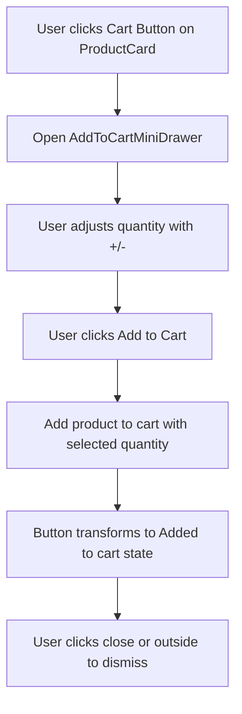
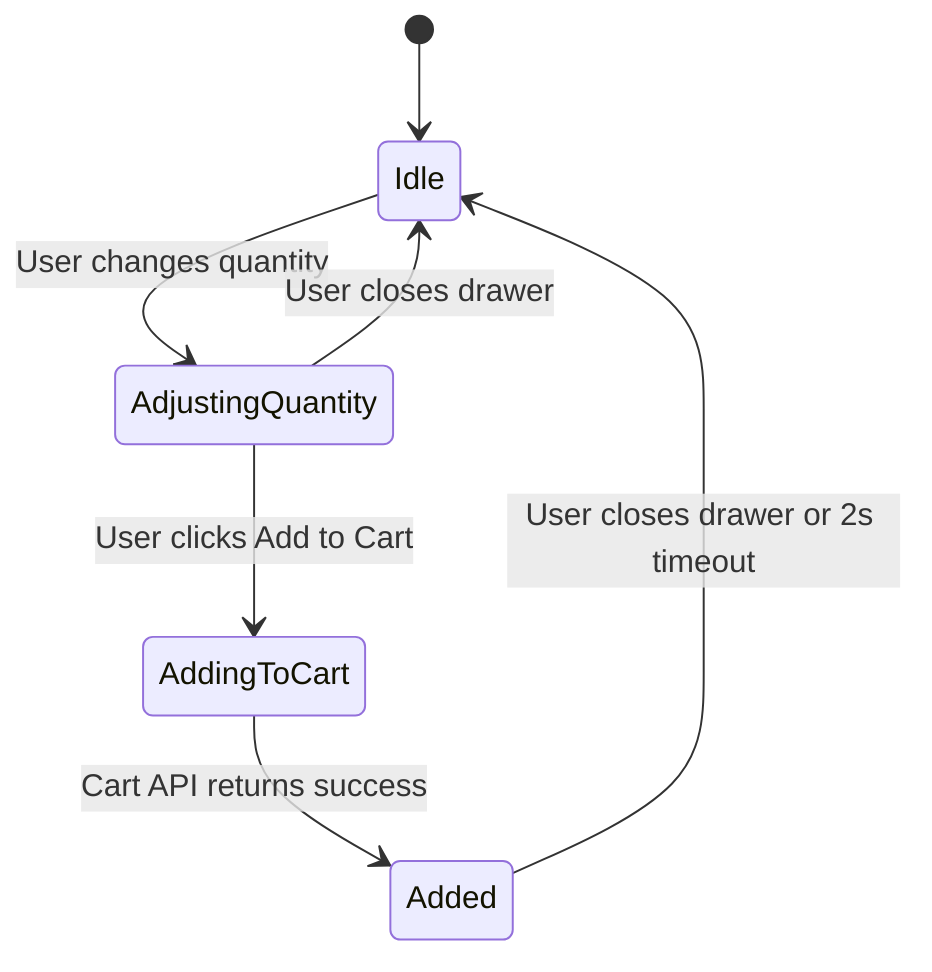

# Add to Cart Mini-Drawer - Architectural Design

## Executive Summary

This document outlines the comprehensive rearchitecture of the add-to-cart workflow to fix existing issues and implement the requested functionality. The new design introduces an `AddToCartMiniDrawer` component that appears centered on the screen when a user clicks the cart button on any product card, allowing users to adjust quantity before adding to cart.

## Current Implementation Analysis

### Issues Identified

1. **Incorrect Flow Order**: In [`ProductCard.tsx`](frontend/components/ProductCard.tsx:34), when clicking the cart button, the product is added to cart immediately (line 45-47), then the quick cart modal opens. Users cannot adjust quantity before adding.

2. **Modal Shows Post-Add State**: The [`QuickCartModal.tsx`](frontend/components/QuickCartModal.tsx:67) displays the product AFTER it's been added to cart, with quantity controls that update the cart in real-time rather than letting users preview first.

3. **Missing Button State Transformation**: The current implementation lacks the "Add to Cart" → "Added to cart" button state transformation requested by users.

4. **No Pre-Add Quantity Adjustment**: Users cannot set their desired quantity before the item is added to the cart.

## Proposed Solution

### Component Architecture

We will create a new `AddToCartMiniDrawer` component that:

- Appears centered on the screen (using Dialog component)
- Displays the product image prominently
- Provides quantity adjustment controls (plus/minus buttons)
- Contains an "Add to Cart" button that transforms to "Added to cart" state
- Features a close button to dismiss the mini-drawer

### Component Structure



### Files to Modify/Create

| File                                          | Action | Description                              |
| --------------------------------------------- | ------ | ---------------------------------------- |
| `frontend/components/AddToCartMiniDrawer.tsx` | Create | New mini-drawer component                |
| `frontend/components/ProductCard.tsx`         | Modify | Trigger mini-drawer on cart button click |
| `frontend/components/Navbar.tsx`              | Modify | Remove QuickCartModal integration        |

## Component Specifications

### AddToCartMiniDrawer Component

#### Props Interface

```typescript
interface AddToCartMiniDrawerProps {
  open: boolean;
  onOpenChange: (open: boolean) => void;
  product: {
    _id: string;
    name: string;
    price: number;
    image: string;
  };
}
```

#### UI Elements

1. **Product Image Display**
   - Centered image container (w-48 h-48)
   - Rounded corners with overflow hidden
   - Fallback "No Image" state

2. **Quantity Controls**
   - Plus/minus buttons with minus icon
   - Central quantity display (1-based, min: 1)
   - Disabled state for minus when quantity is 1

3. **Add to Cart Button**
   - Primary button style
   - Transforms to "Added to cart" with check icon after click
   - Returns to normal state after 2 seconds or when drawer closes

4. **Close Button**
   - Positioned at top-right
   - X icon from lucide-react
   - Clicking outside also closes the drawer

### State Management



#### Local State

- `quantity`: Current quantity (starts at 1)
- `isAdding`: Loading state during add-to-cart API call
- `isAdded`: Success state for button transformation

## Implementation Details

### Step 1: Create AddToCartMiniDrawer Component

**File**: `frontend/components/AddToCartMiniDrawer.tsx`

```typescript
// Key implementation points:
// - Use Dialog component centered on screen
// - Local quantity state (not synced to cart until add)
// - Handle add-to-cart API call on button click
// - Transform button state after successful add
// - Close on click outside or close button
```

### Step 2: Update ProductCard

**File**: `frontend/components/ProductCard.tsx`

**Changes**:

- Remove immediate add-to-cart on cart button click
- Instead, open the mini-drawer with product info
- Cart button triggers `open-add-to-cart-drawer` custom event with product data

```typescript
// Current (problematic):
const handleAddToCart = async (e) => {
  // adds immediately, then opens modal
  await dispatch(addToCart({ productId, quantity: 1 }));
  window.dispatchEvent(new CustomEvent("open-quick-cart", { detail: product }));
};

// New (desired):
const handleOpenMiniDrawer = (e) => {
  // just open the drawer, don't add yet
  window.dispatchEvent(
    new CustomEvent("open-add-to-cart-drawer", { detail: product }),
  );
};
```

### Step 3: Handle Events in Layout/App

The mini-drawer should be globally accessible. We can:

- Add it to the root layout
- Or manage state via a context provider
- Or use custom events with global state management

### Step 4: Handle Authentication

Before opening the mini-drawer, check if user is authenticated:

- If not authenticated: redirect to login
- If authenticated: open mini-drawer

## API Integration

### Cart Slice (Existing - No Changes Needed)

The [`cartSlice.ts`](frontend/lib/features/cart/cartSlice.ts:70) already has the `addToCart` async thunk:

```typescript
export const addToCart = createAsyncThunk(
  "cart/addToCart",
  async ({ productId, quantity }, { rejectWithValue }) => {
    // API call to add item
  },
);
```

We will use this existing thunk in the new component.

## Edge Cases and Error Handling

| Scenario                         | Handling                                               |
| -------------------------------- | ------------------------------------------------------ |
| Network error during add         | Show error toast, keep drawer open, reset button state |
| User not authenticated           | Redirect to login page before opening drawer           |
| Product out of stock             | Disable add button, show "Out of stock" message        |
| Quantity at minimum (1)          | Disable minus button                                   |
| User closes drawer before adding | Reset local quantity to 1                              |
| Rapid clicks on add button       | Show loading state, prevent duplicate calls            |

## Design Specifications

### Visual Design (from design.txt)

- Primary color: Use from theme
- Border radius: rounded-lg for image container
- Shadows: Use default dialog shadow
- Animation: Default dialog fade-in

### Layout Specifications

```
┌─────────────────────────────────────┐
│  [X]                          ← Close button
│                                     │
│         ┌───────────────┐           │
│         │               │           │
│         │   Product     │           │
│         │    Image      │           │
│         │               │           │
│         └───────────────┘           │
│                                     │
│         Product Name                │
│         Rs. 1,299                   │
│                                     │
│     [ - ]   1   [ + ]              ← Quantity controls
│                                     │
│    ┌─────────────────────┐          │
│    │    Add to Cart     │          │
│    └─────────────────────┘          │
│                                     │
└─────────────────────────────────────┘
```

### Responsive Behavior

- Mobile: Full width with padding
- Tablet: max-w-md centered
- Desktop: max-w-md centered

## Testing Requirements

1. **Unit Tests**
   - Quantity increment/decrement
   - Button state transformation
   - Close on outside click

2. **Integration Tests**
   - Full flow from ProductCard → MiniDrawer → Cart
   - Authentication check
   - Error handling

3. **E2E Tests**
   - User clicks cart → adjusts quantity → adds to cart → verifies cart count

## Migration Path

1. Create new `AddToCartMiniDrawer` component
2. Update `ProductCard` to use new flow
3. Keep existing `QuickCartModal` for other uses (e.g., cart page continue shopping)
4. Remove QuickCartModal from Navbar after confirming no other usage
5. Test thoroughly before removing old code

## Summary

This rearchitecture fixes the core issue: users can now adjust quantity BEFORE adding to cart. The new flow is:

1. User clicks Cart button on product card
2. Mini-drawer appears centered (product info pre-loaded)
3. User adjusts quantity using +/- controls
4. User clicks "Add to Cart"
5. Product added with selected quantity
6. Button transforms to "Added to cart" state
7. User can close the drawer

This provides a better user experience and matches the requested functionality.
