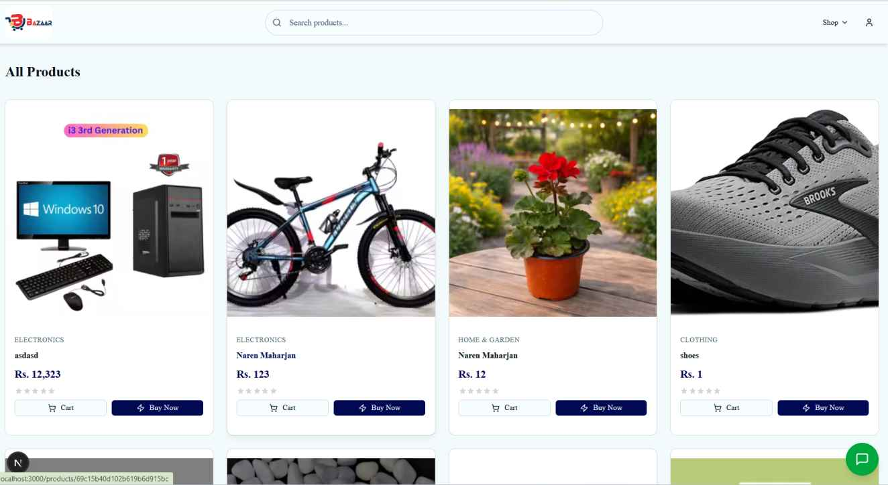
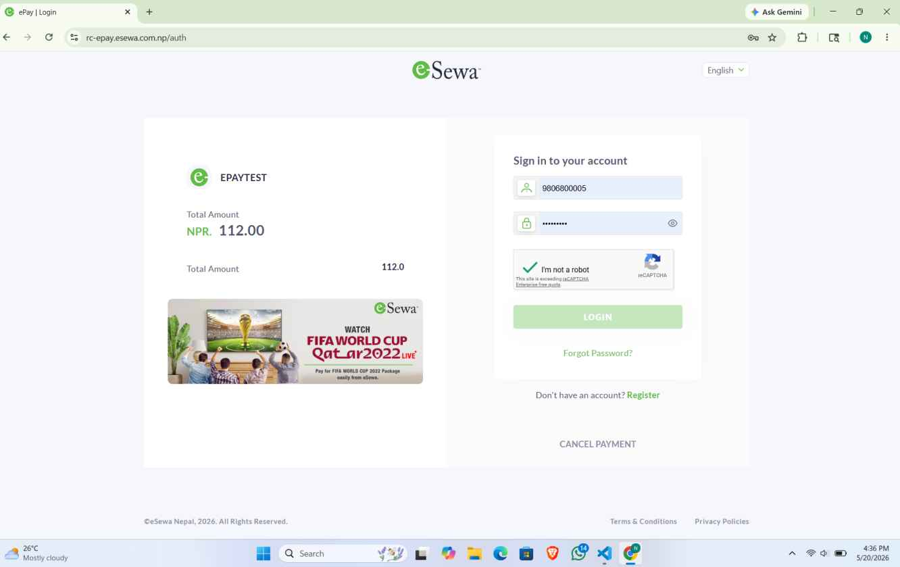

# 🛒 Bazar - E-commerce Platform

## 📖 Project Description

Bazar is a full-featured e-commerce platform specifically designed for the Nepali market. The application provides a seamless online shopping experience with secure user authentication, shopping cart functionality, order management, AI-powered product recommendations, and integrated eSewa payment processing.

## 🎥 Demo & 🖼️ Screenshots
<p align="center">

  ▶️ <a href="https://youtu.be/-wvtIC3Oc5s" target="_blank">Watch the full demo on YouTube</a>

</p>

<br>


<p align="center">

  

</p>

<p align="center">

  

</p>


### Key Highlights

- 🛍️ **Complete E-commerce Solution** - From product browsing to order completion
- 🤖 **AI Recommendations** - Gemini-powered personalized product suggestions
- 💳 **eSewa Integration** - Nepal's leading payment gateway
- 📱 **Responsive Design** - Works on desktop, tablet, and mobile
- 📊 **Admin Dashboard** - Comprehensive analytics and product management

<br>

## ✨ Features

### Core E-commerce Features

- ✅ **Order Management** - Create, track, and manage orders with real-time status updates
- ✅ **Checkout Process** - Complete purchase flow from cart to order completion
- ✅ **Payment Integration** - eSewa payment gateway (Nepal's leading payment processor)
- ✅ **Order History** - Users can view past purchases with detailed order information
- ✅ **Shopping Cart** - Real-time cart with persistent storage
- ✅ **Wishlist** - Save products for later purchase

### User Features

- ✅ **Authentication System**
  - Secure signup/login with JWT tokens
  - Access token + refresh token mechanism
  - Password reset functionality
  - HTTP-only cookie storage
- ✅ **Profile Management** - View and edit profile information
- ✅ **Address Management** - Multiple shipping addresses (add, edit, delete, set default)
- ✅ **Order Tracking** - Real-time order status tracking
- ✅ **Wishlist Management** - Add/remove products to wishlist

### Product Features

- ✅ **Product Browsing** - Browse and filter products by categories
- ✅ **Product Search** - Full-text search across products
- ✅ **Pagination** - Efficient pagination for all product listings
- ✅ **Product Reviews/Ratings** - Users can rate and review products
- ✅ **Featured Products** - Highlight products on homepage
- ✅ **AI Recommendations** - Gemini-powered personalized product suggestions
- ✅ **Product Categories** - Organized category structure

### Admin Features

- ✅ **Admin Dashboard** - Centralized hub for store management
- ✅ **Analytics Dashboard** - Sales analytics, order statistics, revenue tracking
- ✅ **Product Management** - Full CRUD operations for products
- ✅ **Featured Toggle** - Highlight specific products on homepage
- ✅ **Order Management** - View and update order statuses

### Notifications

- ✅ **Email Notifications** - Order confirmation, status updates via Nodemailer
<br>

---

## 🛠️ Technology Stack

### Backend (Node.js & Express)

| Technology    | Version   | Purpose                                     |
| ------------- | --------- | ------------------------------------------- |
| Node.js       | 18+       | JavaScript runtime environment              |
| Express.js    | ^5.2.1    | Web framework for building REST APIs        |
| MongoDB       | ^9.3.0    | NoSQL database with Mongoose ODM            |
| JWT           | ^9.0.3    | Authentication with access & refresh tokens |
| bcryptjs      | ^3.0.3    | Secure password hashing                     |
| Cloudinary    | ^2.9.0    | Cloud-based image management & CDN          |
| Nodemailer    | ^8.0.2    | Email notifications & transactional emails  |
| Multer        | ^2.1.1    | File upload handling                        |
| CORS          | ^2.8.6    | Cross-origin resource sharing               |
| Cookie Parser | ^1.4.7    | Cookie parsing for sessions                 |
| dotenv        | ^17.3.1   | Environment variable management             |

#### External Integrations

- **eSewa API** - Nepal's leading payment gateway
- **Gemini AI** - AI-powered product recommendations
- **Cloudinary CDN** - Image storage and delivery

---

### Frontend (Next.js)

| Technology      | Version  | Purpose                               |
| --------------- | -------- | ------------------------------------- |
| Next.js         | 16.1.6   | React framework with SSR/SSG          |
| React           | 19.2.3   | UI library for building interfaces    |
| Tailwind CSS    | ^4       | Utility-first CSS framework           |
| shadcn/ui       | ^4.0.8   | Accessible UI component library       |
| Recharts        | ^2.15.4  | Data visualization & analytics charts |
| Framer Motion   | ^12.38.0 | Animation library                     |
| Redux Toolkit   | ^2.11.2  | State management                      |
| React Hook Form | ^7.71.2  | Form handling with validation         |
| Zod             | ^4.3.6   | Schema validation                     |
| Lucide React    | ^0.577.0 | Icon library                          |
| date-fns        | ^4.1.0   | Date manipulation utilities           |
| Axios           | -        | HTTP client (via API utilities)       |

---

## 🔌 API Endpoints

### Authentication (`/api/auth`)

| Method | Endpoint                    | Description                  |
| ------ | --------------------------- | ---------------------------- |
| POST   | `/api/auth/signup`          | User registration            |
| POST   | `/api/auth/login`           | User login                   |
| POST   | `/api/auth/logout`          | User logout                  |
| POST   | `/api/auth/refresh-token`   | Refresh access token         |
| POST   | `/api/auth/forgot-password` | Request password reset       |
| POST   | `/api/auth/reset-password`  | Reset password with token    |
| GET    | `/api/auth/profile`         | Get user profile (protected) |

### Products (`/api/products`)

| Method | Endpoint                           | Description              |
| ------ | ---------------------------------- | ------------------------ |
| GET    | `/api/products`                    | Get all products (admin) |
| GET    | `/api/products/featured`           | Get featured products    |
| GET    | `/api/products/category/:category` | Get products by category |
| GET    | `/api/products/recommendations`    | Get AI recommendations   |
| GET    | `/api/products/search`             | Search products          |
| POST   | `/api/products`                    | Create product (admin)   |
| PATCH  | `/api/products/:id`                | Update product (admin)   |
| DELETE | `/api/products/:id`                | Delete product (admin)   |

### Cart (`/api/cart`)

| Method | Endpoint        | Description              |
| ------ | --------------- | ------------------------ |
| GET    | `/api/cart`     | Get cart items           |
| POST   | `/api/cart`     | Add item to cart         |
| PUT    | `/api/cart/:id` | Update item quantity     |
| DELETE | `/api/cart`     | Remove item(s) from cart |

### Wishlist (`/api/wishlist`)

| Method | Endpoint            | Description          |
| ------ | ------------------- | -------------------- |
| GET    | `/api/wishlist`     | Get wishlist         |
| POST   | `/api/wishlist`     | Add to wishlist      |
| DELETE | `/api/wishlist/:id` | Remove from wishlist |

### Orders (`/api/orders`)

| Method | Endpoint                 | Description                 |
| ------ | ------------------------ | --------------------------- |
| GET    | `/api/orders`            | Get user orders             |
| POST   | `/api/orders`            | Create order                |
| GET    | `/api/orders/:id`        | Get order details           |
| PATCH  | `/api/orders/:id/status` | Update order status (admin) |

### Addresses (`/api/addresses`)

| Method | Endpoint                     | Description         |
| ------ | ---------------------------- | ------------------- |
| GET    | `/api/addresses`             | Get user addresses  |
| POST   | `/api/addresses`             | Add address         |
| PUT    | `/api/addresses/:id`         | Update address      |
| DELETE | `/api/addresses/:id`         | Delete address      |
| PATCH  | `/api/addresses/:id/default` | Set default address |

### Payments (`/api/payments`)

| Method | Endpoint                       | Description            |
| ------ | ------------------------------ | ---------------------- |
| POST   | `/api/payments/esewa/initiate` | Initiate eSewa payment |
| POST   | `/api/payments/esewa/verify`   | Verify eSewa payment   |

### Reviews (`/api/reviews`)

| Method | Endpoint                          | Description         |
| ------ | --------------------------------- | ------------------- |
| GET    | `/api/reviews/product/:productId` | Get product reviews |
| POST   | `/api/reviews`                    | Create review       |

### Coupons (`/api/coupons`)

| Method | Endpoint                | Description     |
| ------ | ----------------------- | --------------- |
| GET    | `/api/coupons`          | Get user coupon |
| POST   | `/api/coupons/validate` | Validate coupon |

---

## 🔒 Security Features

- **JWT Authentication** - Access and refresh token mechanism
- **HTTP-only Cookies** - Secure token storage
- **Password Hashing** - bcryptjs for secure password storage
- **Protected Routes** - Middleware-based route protection
- **CORS Configuration** - Controlled cross-origin access
- **Input Validation** - Zod schema validation
- **Rate Limiting** - Protection against abuse

---

## 🚀 Performance Optimization

- **Redis Caching** - Cached featured products and recommendations
- **MongoDB Indexing** - Optimized queries for fast retrieval
- **Pagination** - Efficient handling of large datasets
- **Cloudinary CDN** - Fast image delivery
- **Server-Side Rendering** - Next.js SSR for improved SEO and performance
- **Code Splitting** - Automatic code splitting in Next.js

---

## 🏁 Getting Started

### Prerequisites

Before running the application, ensure you have the following installed:

- **Node.js** 18 or higher
- **MongoDB** (local or Atlas)
- **Cloudinary** account
- **eSewa** merchant account (for payments)


# MongoDB
MONGODB_URI=mongodb://localhost:27017/bazar


# JWT
JWT_SECRET=your_jwt_secret
JWT_REFRESH_SECRET=your_jwt_refresh_secret

# Cloudinary
CLOUDINARY_CLOUD_NAME=your_cloud_name
CLOUDINARY_API_KEY=your_api_key
CLOUDINARY_API_SECRET=your_api_secret

# Email (Nodemailer)
EMAIL_HOST=smtp.gmail.com
EMAIL_PORT=587
EMAIL_USER=your_email
EMAIL_PASS=your_email_password

# eSewa
ESEWA_MERCHANT_ID=your_esewa_merchant_id
ESEWA_SECRET_KEY=your_esewa_secret

# Gemini AI
GEMINI_API_KEY=your_gemini_api_key
```

#### Frontend (`frontend/.env.local`)

```env
NEXT_PUBLIC_API_URL=/api
NEXT_PUBLIC_APP_URL=http://localhost:3000
```

### Running the Application

```bash
# Start backend development server
cd backend
npm run dev

# Start frontend development server (in a new terminal)
cd frontend
npm run dev
```

The application will be available at:

- **Frontend**: http://localhost:3000
- **Backend API**: http://localhost:5000

---

## 📂 Project Structure

```
bazar/
├── backend/
│   ├── src/
│   │   ├── controllers/      # Request handlers
│   │   ├── middleware/       # Custom middleware
│   │   ├── models/           # Mongoose models
│   │   ├── routes/          # API routes
│   │   ├── services/        # Business logic
│   │   ├── lib/             # Utilities (db, redis, cloudinary, email)
│   │   └── server.js        # Entry point
│   ├── package.json
│   └── .env.example
│
├── frontend/
│   ├── app/                  # Next.js App Router
│   │   ├── admin/           # Admin dashboard pages
│   │   ├── checkout/        # Checkout flow
│   │   ├── products/        # Product pages
│   │   └── ...              # Other pages
│   ├── components/          # React components
│   │   └── ui/              # shadcn/ui components
│   ├── package.json
│   └── .env.local.example
│
└── README.md
```

---

## 📄 License

This project is licensed under the **ISC License**.

---

<p align="center">
  Built with ❤️ for the Nepali e-commerce community
</p>
